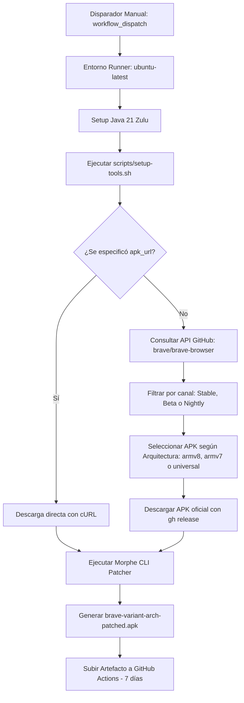

# Multi-App Android Morphe Patcher

Repositorio modular para la automatización del proceso de compilación y parcheo de aplicaciones de **Android** utilizando **Morphe CLI** a través de **GitHub Actions**. La arquitectura base está desacoplada para permitir la incorporación de múltiples aplicaciones (Brave Browser, YouTube, Reddit, etc.) reutilizando scripts y herramientas comunes.

---

## 🏗️ Arquitectura Modular

El repositorio está estructurado para separar la configuración de herramientas de la lógica de cada aplicación:

```text
.
├── .github/
│   └── workflows/
│       └── patch-brave.yml      # Workflow específico para Brave Browser
├── scripts/
│   └── setup-tools.sh           # Script reusable para descargar Morphe CLI, parches e integraciones
├── .gitignore
└── README.md
```

### Script Base: `scripts/setup-tools.sh`
Permite descargar e inicializar en el directorio `tools/`:
- **Morphe CLI** (`MorpheApp/morphe-cli` -> `tools/cli.jar`).
- **Bundle de parches** desde el repositorio indicado por parámetro (por defecto `dh6k/morphe-patches` -> `tools/patches.jar`).
- **APK de integraciones** (`*integrations*.apk` -> `tools/integrations.apk`) con fallback automático a `MorpheApp/morphe-patches`.

---

## 📌 Objetivo Actual: Brave Browser

El primer objetivo implementado es el parcheo de **Brave Browser** con el catálogo de **[dh6k/morphe-patches](https://github.com/dh6k/morphe-patches)**.

### Parches de dh6k
- Desbloqueo de opciones internas avanzadas y **Brave Origin**.
- Fondos de pantalla personalizados en la nueva pestaña (New Tab Page).
- Eliminación de promociones y telemetría no deseada.
- Optimizaciones de rendimiento y estética.

### Flujo de Ejecución (GitHub Actions)



---

## ⚙️ Requisitos y Dependencias

### En GitHub Actions (Recomendado)
- **Cuenta de GitHub** con acceso al repositorio (Fork o repositorio propio).
- Ejecución en runners estándar gratuitos `ubuntu-latest`.
- Permiso `contents: read` con `GITHUB_TOKEN` integrado.

### En Entorno Local (Opcional)
- **JDK 21+** (ej. Azul Zulu OpenJDK 21).
- **GitHub CLI (`gh`)**, **cURL** y **jq**.
- Bash (Linux, macOS o WSL/Git Bash en Windows).

---

## 🚀 Guía de Ejecución: Workflow de Brave (`workflow_dispatch`)

1. Ve a la pestaña **Actions** en tu repositorio de GitHub.
2. En la barra lateral izquierda, selecciona el workflow **Patch Brave Browser**.
3. Haz clic en **Run workflow** (botón desplegable a la derecha).
4. Configura los parámetros deseados:

| Parámetro | Tipo | Opciones / Formato | Default | Descripción |
| :--- | :--- | :--- | :--- | :--- |
| `brave_variant` | `choice` | `Stable`, `Beta`, `Nightly` | `Stable` | Canal de distribución oficial de Brave Browser. |
| `architecture` | `choice` | `armv8`, `armv7`, `universal` | `armv8` | Arquitectura del procesador del dispositivo de destino. |
| `apk_url` | `string` | URL HTTP/HTTPS directa | *(vacío)* | Enlace manual a un APK específico (anula la búsqueda automática). |

5. Pulsa en **Run workflow** para iniciar el trabajo.

### Variantes y Arquitecturas
- **`armv8` (arm64-v8a)**: **Recomendado**. Para teléfonos y tablets modernos de 64 bits (descarga `Bravearm64Universal.apk`).
- **`armv7` (armeabi-v7a)**: Para dispositivos de 32 bits o Android legado (descarga `BraveMonoarm.apk`).
- **`universal`**: APK universal multiarquitectura.

---

## 📥 Descarga del Artefacto Generado

1. En la pestaña **Actions**, entra en la ejecución completada (marcada en verde ✅).
2. Desplázate a la sección **Artifacts** al final del resumen.
3. Descarga el archivo `.zip` del artefacto denominado:
   ```text
   brave-patched-<Variante>-<Arquitectura>
   ```
4. Descomprime el archivo `.zip` para extraer el APK `brave-<Variante>-<Arquitectura>-patched.apk`.

> [!NOTE]
> Los artefactos se conservan durante **7 días** en GitHub Actions antes de ser purgados automáticamente.

> [!WARNING]
> Debido a que el APK se firma con una clave generada en el parcheo, debes **desinstalar la versión oficial de Brave de Play Store** antes de instalar el APK parcheado para evitar conflicto de firmas.

---

## ➕ Cómo Agregar Nuevas Aplicaciones (YouTube, Reddit, etc.)

Gracias al diseño modular, agregar soporte para otra aplicación solo requiere crear un nuevo archivo de workflow en `.github/workflows/` (por ejemplo `.github/workflows/patch-youtube.yml`) reutilizando `scripts/setup-tools.sh`.

### Plantilla de Ejemplo: `.github/workflows/patch-<app>.yml`

```yaml
name: Patch <App>

on:
  workflow_dispatch:
    inputs:
      apk_url:
        description: 'URL directa al APK base de <App>'
        required: true
        type: string
      patches_repo:
        description: 'Repositorio de parches a utilizar'
        required: false
        type: string
        default: 'MorpheApp/morphe-patches'

jobs:
  patch:
    name: Patch <App> APK
    runs-on: ubuntu-latest
    steps:
      - name: Checkout repository
        uses: actions/checkout@v4

      - name: Setup Java 21 (Zulu)
        uses: actions/setup-java@v4
        with:
          distribution: 'zulu'
          java-version: '21'

      # Reutilización del script modular pasando el repositorio deseado
      - name: Setup tools and patches
        env:
          GH_TOKEN: ${{ secrets.GITHUB_TOKEN }}
        run: |
          chmod +x scripts/setup-tools.sh
          bash scripts/setup-tools.sh "${{ inputs.patches_repo }}"

      - name: Download input APK
        run: |
          curl -fL -o input.apk "${{ inputs.apk_url }}"

      - name: Patch APK with Morphe CLI
        run: |
          java -jar tools/cli.jar patch \
            --patches tools/patches.jar \
            --out "<app>-patched.apk" \
            input.apk

      - name: Upload patched APK artifact
        uses: actions/upload-artifact@v4
        with:
          name: <app>-patched
          path: <app>-patched.apk
          retention-days: 7
```
