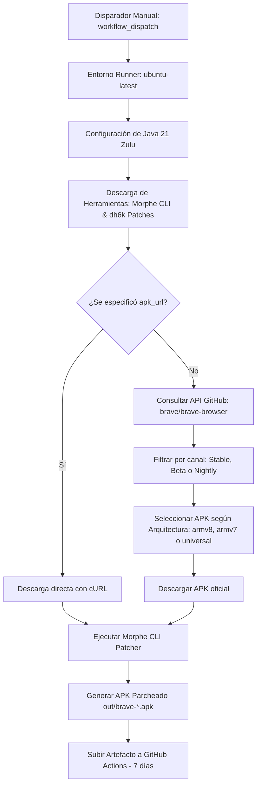

# Brave Android Morphe Patcher

Repositorio para la automatización del proceso de compilación y parcheo de **Brave Browser para Android** utilizando **Morphe CLI** y el catálogo de parches de **[dh6k/morphe-patches](https://github.com/dh6k/morphe-patches)** a través de **GitHub Actions**.

---

## 📌 Descripción Técnica

Este proyecto proporciona un pipeline de Integración Continua (CI) mediante GitHub Actions que automatiza todo el ciclo de vida del parcheo de Brave Browser para Android:

1. **Resolución dinámica de binarios**: Descarga la versión más reciente de **Morphe CLI** (`MorpheApp/morphe-cli` / `morphe-desktop`) y el conjunto de parches mantenido por **dh6k** (`dh6k/morphe-patches`), gestionando retrocompatibilidad de paquetes `.mpp`/`.jar` y librerías de integración (`integrations.apk`).
2. **Descarga selectiva de Brave Browser**: Consulta los releases oficiales de `brave/brave-browser` en GitHub para obtener el APK oficial según el canal de lanzamiento y la arquitectura seleccionada, con soporte para URLs directas personalizadas.
3. **Inyección y compilación de parches**: Ejecuta el motor de parcheo en un entorno Java 21 LTS con validación y firma automática del binario resultante.
4. **Almacenamiento de artefactos**: Genera y empaqueta el APK listo para ser instalado en dispositivos Android, reteniéndolo como artefacto durante 7 días.

### Parches de dh6k
Los parches de **dh6k** habilitan funciones extendidas en el navegador Brave, tales como:
- Desbloqueo de opciones internas avanzadas y **Brave Origin**.
- Habilitación de fondos de pantalla personalizados en la nueva pestaña (New Tab Page).
- Eliminación de promociones y componentes de telemetría no deseados.
- Mejoras de rendimiento y ajustes de interfaz de usuario.

---

## 🏗️ Flujo de Ejecución (GitHub Actions)



---

## ⚙️ Requisitos y Dependencias

### Para ejecución en GitHub Actions (Recomendado)
- **Cuenta de GitHub** con acceso al repositorio (un Fork o repositorio privado/público propio).
- No requiere runners auto-hospedados; se ejecuta de forma nativa en los runners gratuitos `ubuntu-latest`.
- Permiso estándar `contents: read` (el token `GITHUB_TOKEN` es inyectado automáticamente por GitHub).

### Para ejecución local (Opcional)
Si deseas replicar el proceso de parcheo localmente en tu equipo:
- **Java Development Kit (JDK)**: Versión 21 o superior (ej. Azul Zulu OpenJDK 21).
- **GitHub CLI (`gh`)**: Para descargar binarios de releases directamente.
- **cURL** y **jq**: Para parseo de JSON y descargas HTTP.
- **Android Debug Bridge (`adb`)**: Opcional, para instalar directamente en el dispositivo físico o emulador.

---

## 🚀 Instrucciones de Ejecución Manual (`workflow_dispatch`)

El flujo de trabajo se activa manualmente desde la interfaz web de GitHub:

1. Ve a la pestaña **Actions** en tu repositorio de GitHub.
2. En la barra lateral izquierda, selecciona el workflow **Patch Brave Browser**.
3. Haz clic en el botón desplegable **Run workflow** (a la derecha).
4. Configura los parámetros deseados:

| Parámetro | Tipo | Opciones / Formato | Default | Descripción |
| :--- | :--- | :--- | :--- | :--- |
| `brave_variant` | `choice` | `Stable`, `Beta`, `Nightly` | `Stable` | Canal de distribución oficial de Brave Browser. |
| `architecture` | `choice` | `armv8`, `armv7`, `universal` | `armv8` | Arquitectura del procesador del dispositivo de destino. |
| `apk_url` | `string` | URL HTTP/HTTPS directa | *(vacío)* | Enlace manual a un APK específico (anula la búsqueda automática). |

5. Haz clic en el botón verde **Run workflow** para iniciar el proceso.

---

## 📱 Guía de Variantes y Arquitecturas

### Variantes de Brave
- **Stable**: Versión estable para uso diario. Recomendada para máxima fiabilidad.
- **Beta**: Canal de pruebas con nuevas características semanas antes de llegar a estable.
- **Nightly**: Canal de desarrollo con las novedades más recientes (actualizaciones diarias).

### Arquitecturas
- **`armv8` (arm64-v8a)**: **Recomendado**. Compatible con casi el 100% de los teléfonos inteligentes y tablets Android modernos (lanzados en los últimos 7-8 años). Descarga activos como `Bravearm64Universal.apk` o `Bravearm64.apk`.
- **`armv7` (armeabi-v7a)**: Para dispositivos antiguos de 32 bits o equipos con Android 8.0/8.1 legado. Descarga activos como `BraveMonoarm.apk`.
- **`universal`**: APK multiarquitectura que contiene librerías compartidas.

---

## 📥 Descarga del Artefacto Generado

Una vez que el workflow finalice (tiempo estimado: 2 a 4 minutos):

1. En la pestaña **Actions**, haz clic en la ejecución completada (marcada con check verde ✅).
2. Desplázate hacia la parte inferior hasta la sección **Artifacts**.
3. Verás un artefacto con el formato:
   ```text
   brave-patched-<Variante>-<Arquitectura>
   ```
   *(Ejemplo: `brave-patched-Stable-armv8`)*
4. Haz clic sobre el nombre del artefacto para descargar el archivo `.zip`.
5. Extrae el archivo `.zip` en tu computadora o directamente en tu dispositivo Android para obtener el archivo `.apk` parcheado.

> [!NOTE]
> Los artefactos de GitHub Actions tienen un período de retención configurado de **7 días**, tras el cual se eliminarán automáticamente para conservar espacio de almacenamiento.

---

## 📲 Instalación en Android y Notas Importantes

> [!WARNING]
> **Conflicto de firmas criptográficas:**
> Debido a que el APK es recompilado y firmado con una clave generada por Morphe, **no es posible instalar este APK como actualización sobre la versión oficial de Brave de Google Play Store**.
> Debes **desinstalar primero la versión previa de Brave** antes de instalar el APK parcheado (asegúrate de respaldar tus marcadores y códigos de sincronización Brave Sync previamente).

1. Transfiere el archivo `.apk` a tu dispositivo Android (vía USB, Telegram, Google Drive, etc.).
2. Abre tu administrador de archivos en Android y selecciona el `.apk`.
3. Si el sistema lo solicita, autoriza la opción **Permitir desde esta fuente** (Instalación de aplicaciones desconocidas).
4. Pulsa en **Instalar** y completa el proceso.
5. Inicia Brave y verifica las opciones de personalización de dh6k en los ajustes del navegador.
